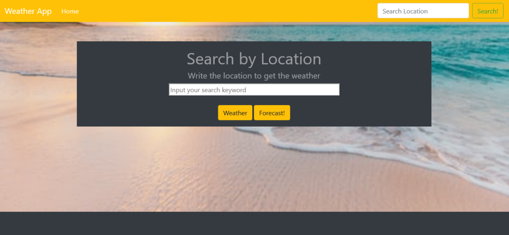
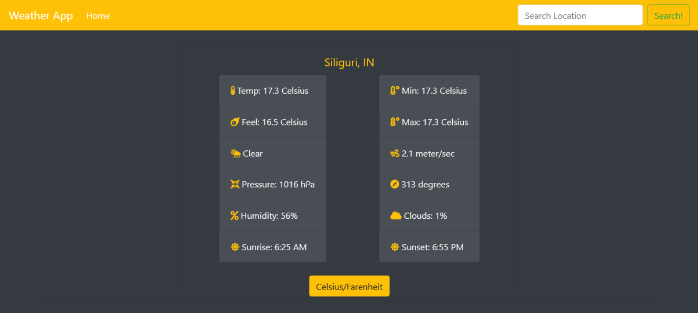
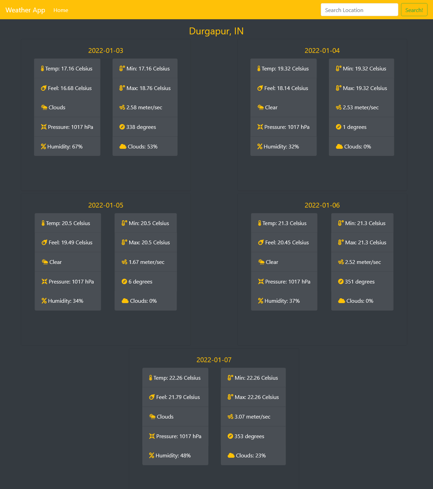

# WeatherApp

>  A weather app that pulls from the OpenWeatherMap API to allow users to search for and view the forecast in cities worldwide. Built with JavaScript.

Landing Page:

Actual Weather:

5-Day Forecast:

Additional description about the project and its features.

## Built With

- HTML 
- CSS
- JAVASCRIPT
- NPM
- WEBPACK
- BOOTSTRAP
- GITHUB ACTIONS

Reminder for me to put the link- AMAN BANGARI

## Getting Started

### Usage
- To get a local copy up and running follow these simple example steps.

Clone the repository unto your local machine cd to the folder.

### Prerequisites

- A modern browser, up to date.  :muscle:

### Run tests

- There is no automated tests for this project.

## Future features

- Add extra functionality and a contact page.

## Author

👤 AMAN BANGARI
- Github: [@aman-bangari](https://github.com/aman-bangari2003)  
- Linkedin: [amanbangari](https://www.linkedin.com/in/aman-bangari-220a7b220) 

## Show your support

Give a ⭐️ if you like this project!

## 📝 License

This project is [MIT](lic.url) licensed.

<!-- MARKDOWN LINKS & IMAGES -->
<!-- https://www.markdownguide.org/basic-syntax/#reference-style-links -->
[contributors-shield]: https://img.shields.io/github/contributors/javitocor/Weather-App-JS.svg?style=flat-square
[contributors-url]: https://github.com/javitocor/Weather-App-JS/graphs/contributors
[forks-shield]: https://img.shields.io/github/forks/javitocor/Weather-App-JS.svg?style=flat-square
[forks-url]: https://github.com/javitocor/Weather-App-JS/network/members
[stars-shield]: https://img.shields.io/github/stars/javitocor/Weather-App-JS.svg?style=flat-square
[stars-url]: https://github.com/javitocor/Weather-App-JS/stargazers
[issues-shield]: https://img.shields.io/github/issues/javitocor/Weather-App-JS.svg?style=flat-square
[issues-url]: https://github.com/javitocor/Weather-App-JS/issues
